

  
  

# Story

A good journey does not always begin with code.
Mine began with curiosity.

---

## Chapter 01 — The boy who loved life

Before software, there was wonder.

As a child, I was fascinated by plants, animals and the quiet intelligence of nature.
I liked observing how living things connected, grew and adapted.
That early curiosity shaped the way I still learn today: by noticing patterns and asking how things work.

  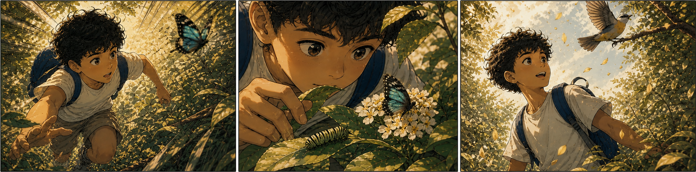

---

## Chapter 02 — Biology, science and public life

  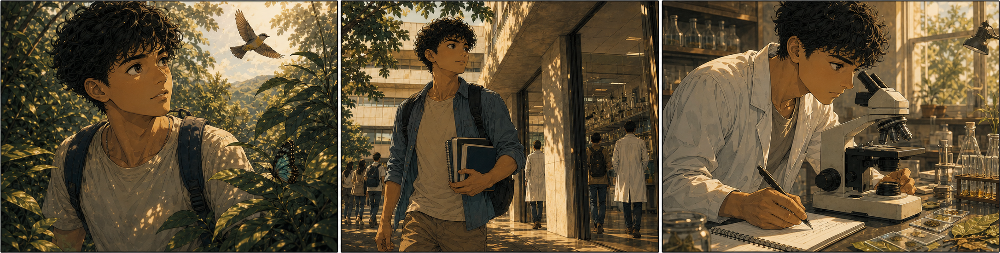

That curiosity led me to Biology at UNESP.

University gave structure to what had once been instinct. There, I learned that science was not only about studying life, but also about observing carefully, asking better questions and acting with method.

  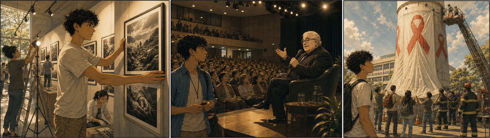

That period was also full of movement. I helped bring culture into the academic space, including a Sebastião Salgado exhibition and a lecture with Jô Soares. I took part in public actions that turned the campus into a place of awareness, creativity and participation — even helping cover the institute’s water tower with a giant condom during an AIDS prevention campaign, with support from the fire department.

  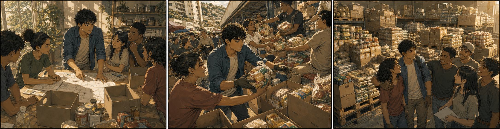

Outside the classroom, community work also shaped me. With Rotaract, I helped collect more than one ton of food in a single weekend. It was one of those moments that taught me that organization, communication and purpose can move people toward something concrete.

  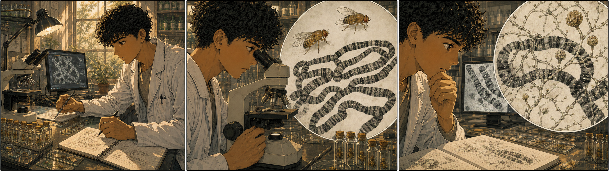

In research, I went deeper into molecular biology, working with Drosophila, polytene chromosomes and cytogenetic observation. During that scientific initiation, I identified a fungus associated with changes in polytene chromosome structures — a small discovery, but a decisive one for the way I learned to investigate complexity.

Biology gave me more than a degree path. It gave me method, public spirit and the first real experience of turning curiosity into disciplined work.

---

## Chapter 03 — Genetic transformation and research depth

  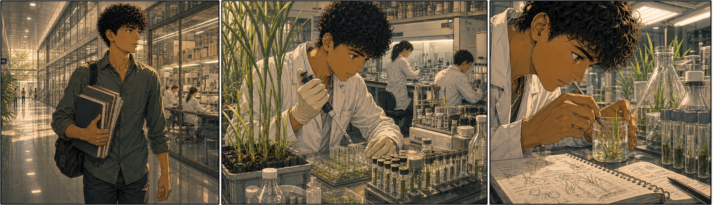

Later, that path deepened through my MSc and PhD work at USP.

  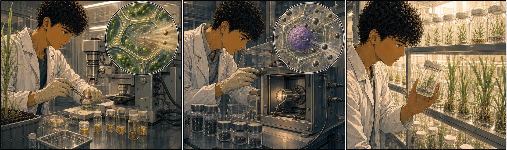

My research moved into plant biotechnology, genetic transformation and experimental analysis. I worked with biolistic transformation, using gold particles for chloroplast transformation and tungsten particles for nuclear transformation.

That work led me to develop transgenic sugarcane through micropropagation — a demanding process that connected molecular biology, plant tissue culture, experimental design and long-term scientific persistence.

Research at that level taught me more than technique. It taught me how to work with uncertainty, how to repeat, measure, compare and interpret results until the evidence became clear.

  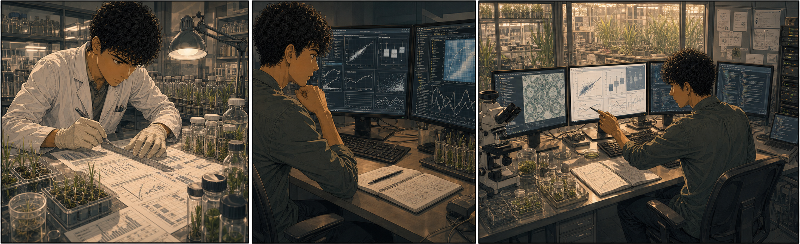

I also analyzed experimental data using R, MATLAB and statistical methods, turning biological observations into structured evidence.

That phase strengthened the analytical mindset I still bring into technology today: investigate deeply, validate carefully and build from data, not assumption.

---

## Chapter 04 — The turn toward technology

Over time, another world began to pull me in: technology.

It started quietly — first as fascination, then as possibility. I had always been drawn to systems, patterns and hidden structures. In Biology, I saw them in living organisms, cells, genes and ecosystems. In technology, I began to recognize the same logic in code, data, interfaces and automation.

  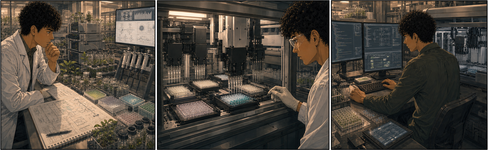

That bridge became tangible in my scientific work. I worked with robotic liquid-handling systems for automated pipetting, where precise hardware, repeatable protocols and software-controlled workflows came together. Watching experiments become programmable showed me how computation could extend the reach of the laboratory.

  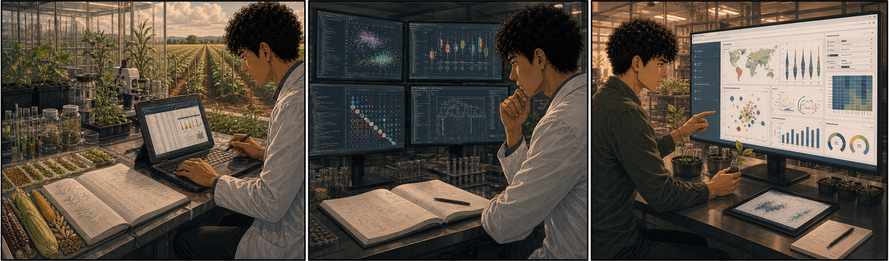

I also analyzed genetic traits across agricultural cultivars, using R for statistical exploration and Power BI to transform complex experimental results into clear, interactive dashboards. Data stopped being only the output of research; it became a language for comparison, communication and decision-making.

Programming did not feel like abandoning science. It felt like translating the same curiosity into a new language.

  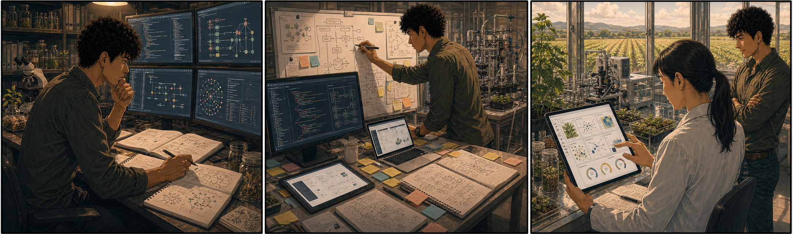

The more I learned, the more I understood that software could also be a living system: something designed, tested, adapted and improved. Code gave me a way to build ideas, automate processes, connect information and turn abstract thinking into practical tools.

That transition became more than a career change. It became a new form of love for learning — the same scientific curiosity, now expressed through logic, architecture, product thinking and creation.

Technology gave me a new medium.

The purpose remained the same: to understand complex systems and build something meaningful from them.

---

## Chapter 05 — Building a new chapter

That is why I moved into Computer Science at Anhanguera.

Now I am building a new stage with intention:
software, mobile development, data, cloud and AI.
I see technology not only as code, but as a way to create useful, elegant and practical solutions.

  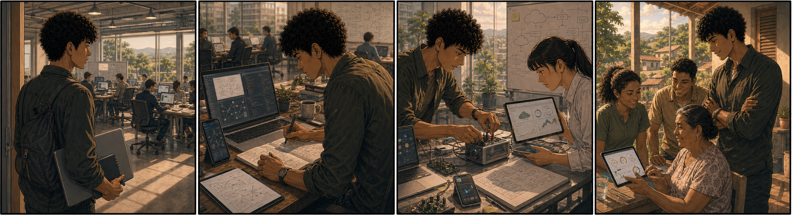

---

## Chapter 06 — Who I am today

Today, I work at the intersection of mobile, data, cloud and intelligent systems.

From biology to software, the thread has always been the same:
curiosity, structure and the desire to build something meaningful.
What changed was the medium.
The purpose remained.

  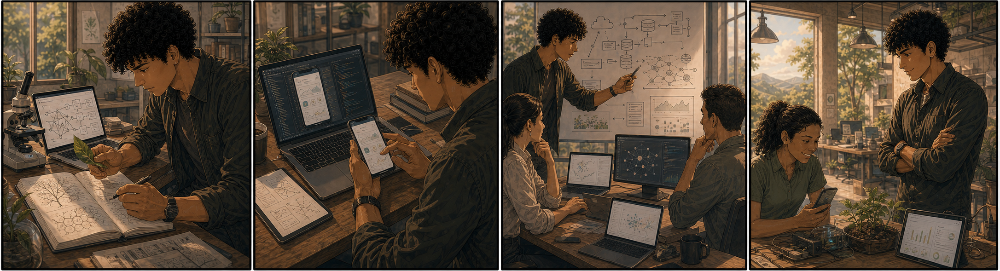

