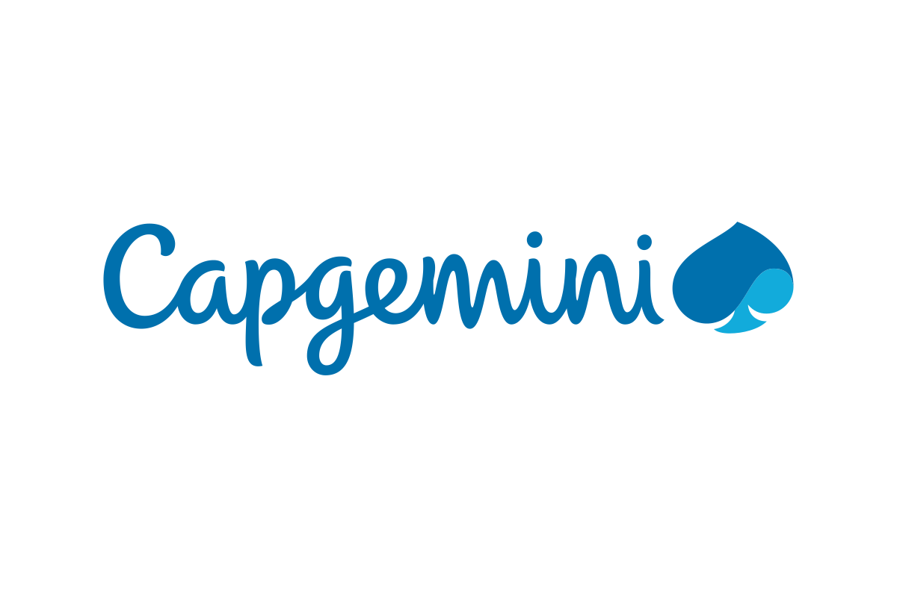

  

<h2 align = "center"> 🧑🏽‍💻 Full Stack Developer | 📊 Data & AI & LLM | ☁️ Cloud </h2>
 
<h3 align="center"> 🛠 Skills & Expertise 🛠  

  🌱 <b>Frameworks and Libraries:</b> Angular, ReactJS, Next.js  
  📊 <b>Data & AI & LLM:</b> Pandas, NumPy, Matplotlib, scikit-learn  
  ☁️ <b>Cloud is so awesome: AWS, Google, Azure, Oracle. </b> I absolutely love exploring the APIs and the endless possibilities they offer for building, automating, and scaling solutions. 🚀✨  
  🏄‍♂️ <b>Agile Methodologies:</b> Scrum, Kanban  
  🌍 <b>Languages:</b> Fluent in English, Advanced in Spanish, Intermediate in French and Italian, Technical in German, Starting in Mandarin, Native in Portuguese  

  <a href="https://github.com/Andrehlb">
  <a href="https://andrehlb.github.io/andrehlb-mslearn-copilot-codespaces-javascript/">
  
  

 

<h2 align = "center"> Please tap on the Badges to navigate to the respective code project </h2>
  
 
  
  
    
    
    
  
  <a href= "#dart-projects">
  
  

  

  

       

  

  ## 
Bellow my Social networks 🌐

  
  
  
 	
   
  
   

    
  ## 
My Daily Dev Card

  

## 👨‍💻🚀 The Code Projects

### 🔥🚀 Top Projects

- **Simple Banking System - DB & Crypto Token** - Sistema bancário avançado com suporte a criptografia e gerenciamento de tokens. *(Python, PostgreSQL, Security)* [🔗 Repositório](https://github.com/Andrehlb/SimpleBankingSystem-DB-Crypto-token.git)
- **Java RESTful API - League of Legends** - API desenvolvida durante o Santander Dev Week 2024. *(Java 21, Spring Boot 3, H2 Database)* [🔗 Repositório](https://github.com/Andrehlb/Java-RestFull-API-SpringBoot-LeagueOfLegends-Santander)
- **DataScience\_Embraer** - Projetos de Data Science aplicados à indústria aeronáutica. *(Python, SQL, R, Azure, AWS S3)* [🔗 Repositório](https://github.com/Andrehlb/DataScience_Embraer)
- **Desafios-Challenges-** - Diversos desafios de Data Science explorando diferentes técnicas e algoritmos. *(Jupyter Notebook)* [🔗 Repositório](https://github.com/Andrehlb/Desafios-Challenges-)

### 🏦 Backend Development

- **Task Manager API (Flask)** - Backend para gerenciamento de tarefas utilizando Flask. *(Python, Flask, SQLite)* [🔗 Repositório](https://github.com/Andrehlb/TaskManager-Python.git)
- **Task Manager API (Fastify)** - Backend de gerenciamento de tarefas otimizado para alta performance. *(Node.js, Fastify, PostgreSQL)* [🔗 Repositório](https://github.com/Andrehlb/TaskManager-Fastify-React.git)
- **Auto Event Google Calendar** - Automação para criação de eventos no Google Calendar a partir de informações extraídas de páginas da web. *(Python, Google Calendar API)* [🔗 Repositório](https://github.com/Andrehlb/auto-event-google-calendar)
- **Auditoria EC2 AWS CloudTrail Cafeteria** - Projeto para auditoria de ações executadas na conta AWS usando o AWS CloudTrail. *(AWS, CloudTrail)* [🔗 Repositório](https://github.com/Andrehlb/auditoria-EC2-AWS_CloudTrail_Cafeteria)

### ☁️ Cloud Computing & DevOps

- **Azure AI - Bike Rental Endpoints** - Desenvolvimento de endpoints para aluguel de bicicletas na Azure AI. *(Azure ML, Python, FastAPI)* [🔗 Repositório](https://github.com/Andrehlb/AzureAI-MLStudio-BikeRental-EndPoints)
- **Azure ML - Face & Text Analysis** - Processamento de imagens e reconhecimento facial no Azure ML. *(Python, OpenCV, Azure Cognitive Services)* [🔗 Repositório](https://github.com/Andrehlb/AzureML-FaceTextAnalysisDataProcessing)
- **AWS EC2 Bastion & Webserver** - Gerenciamento de instâncias AWS EC2 para criação de um bastion host e um webserver. *(AWS, EC2, CloudFormation)* [🔗 Repositório](https://github.com/Andrehlb/AWS-EC2-Bastion-Webserver-Connect-CLI-Lab)
- **CafeteriaAppMigration AWS RDS EC2 LAMP** - Migração de um aplicativo web para usar banco de dados gerenciado pelo Amazon RDS e EC2. *(AWS, RDS, EC2, LAMP)* [🔗 Repositório](https://github.com/Andrehlb/CafeteriaAppMigration-AWS-RDS-EC2-LAMP)

### 🎯 Inteligência Artificial & Machine Learning

- **AI - Naive Bayes Classifier** - Implementação de um classificador Naive Bayes para aprendizado de máquina. *(Python, scikit-learn)* [🔗 Repositório](https://github.com/Andrehlb/AI-NaiveBayes-Classifier)
- **LangChain React AI ML LLM Token API Py Agent** - Implementação de um agente ReAct em LangChain para aplicações de IA. *(Python, LangChain, OpenAI API)* [🔗 Repositório](https://github.com/Andrehlb/LangChain-React-AI-ML-LLM-Token-API-Py-agent)

### 🌐 Web Development & Frontend

- **Consumindo API** - Projeto demonstrando consumo de APIs com JavaScript. *(CSS, JavaScript)* [🔗 Repositório](https://github.com/Andrehlb/consumindoAPI)
- **Loja Esportiva AWS** - Desenvolvimento de um e-commerce de artigos esportivos utilizando AWS. *(JavaScript, AWS)* [🔗 Repositório](https://github.com/Andrehlb/lojaEsportiva-AWS)
- **HTML & JavaScript Tax Calculator** - Aplicação de cálculo de impostos via JavaScript. *(HTML, CSS, JavaScript)* [🔗 Repositório](https://github.com/Andrehlb/Calculadora-Impostos-Vendas-JavaScript)
- **Web Page using PyScript** - Criação de páginas interativas utilizando PyScript. *(Python, HTML, CSS, PyScript)* [🔗 Repositório](https://github.com/Andrehlb/Web-Page-using-PyScript)

---
📌 Nota: A lista acima foca nos projetos mais relevantes para colaboradores, recrutadores e empregadores.  Outros projetos podem ser encontrados no meu GitHub.  Veja mais em [🔗 Repositórios][repositoriesLink].

---

## 
Andrehlb's Profile 

### 🎓 Education & Certifications 

#### Postgraduate Education
-  📚 [Data Science Postgraduate Program at Univitória, ES; (2023-2025)](assets-Grad-postGrad/PostGrad_Univitoria_ES/)
-  🎓 [MsC at ESLAQ/USP, SP; (2010)](assets-Grad-postGrad/MsC_ESLAQ_USP/)
-  🎓 [PhD at ESALQ/USP, SP;(2016)](assets-Grad-postGrad/PhD_ESALQ_USP/)

### UNDERGRADUATE EDUCATION

* 👨‍💻 [Computer Science at Anhnanguera, SP, (2025-208);
* 👨‍💻 [Computer Science at Estácio, SP, (2004-2025);](assets-Grad-postGrad/gradEstacio_SP/diplomaCienciaComputacaoGradEstacioSP-Frente.png)
* 🌱 [Biology at IBILCE/UNESP, SP;(2000)](assets-Grad-postGrad/gradIBILCE_UNESP/diplomaBiologiaGradUNESP-Frente.png)

### COMPUTER AND STACKS FORMATION
- Degree: IBM - MasterTech - Match! , started July, 2023.

- Data Science and Machine Learning:
  - [Alura | Grupo Boticário | Desenvolve 2023 (2023);](https://github.com/Andrehlb/desenvolve2023.github.io.git)
  - [EMBRAER XPEducation (2023).](https://github.com/Andrehlb/DataScience_Embraer.git)

- Full-Stack Development:
  * Let´s Code: Back-End: Python and Java;
  
  * 

  * <a href="https://web.dio.me/users/andrehlbarbosa?tab=projects&page=1" target="_blank"> 

 
  * IBM by Coursera: Web Development;
  * Start.Se: Web Development;
  * RocketSeat: Front-End | JS, CSS;
  * Alura: Flutter Mobile dev;
   
- R language for bioinformatic data analysis at ESALQ/USP, Piracicaba, SP (2011-2014);

## Certificates/ Credentials

### Ada Tech | Santander Coders 2025

- [Lógica de programação com Javascript (Node.JS), atualização, Jan 2025](https://github.com/Andrehlb/Andrehlb/blob/main/certificados/Node_JSLogica-programacao-Javascript-Jan2025.png)
- [Git e Versionamento, atualização, Dez 2024](https://github.com/Andrehlb/Andrehlb/blob/main/certificados/gitVersionamento.png)
- [Introdução ao Node.JS com Express, atualização, Jan 2025](https://github.com/Andrehlb/Andrehlb/blob/main/certificados/introducaoNodeJS-Express.png)

[repositoriesLink]: https://github.com/Andrehlb?tab=repositories
